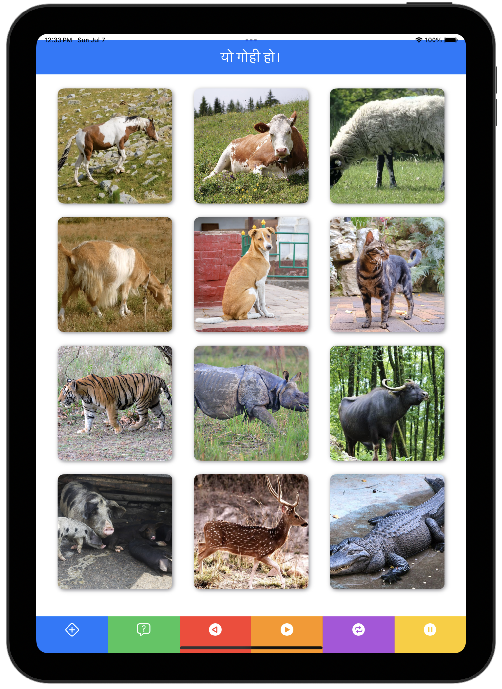

<h2 align="center">LexiForge</h2>
<h3 align="center">A language learning app for iOS focused on implementing the GPA method's dirty dozen</h3>
 

 

## Disclaimer

- ⚠️ The project is under **active** development.
- ⚠️ Expect bugs and breaking changes.

## About

This is essentially pre-alpha. The plan is to have the ability to change the language you are learning, and to add vocabulary words but as of now there are just 12 animal words hardcoded (in Nepali) in the app.
If you want to learn those 12 animal words in Nepali, this will be great for you! A couple of them are mispronounced though, be careful.
There is no iOS app published on the app store as of yet, sorry! You'll have to side-load it I guess.

## Links

Access info about GPA [here](https://www.growingparticipation.com/). LexiForge is focused on the dirty dozen (or "Rough-and-Ready-Dozen") game from GPA Phase 1.

## Screenshot

